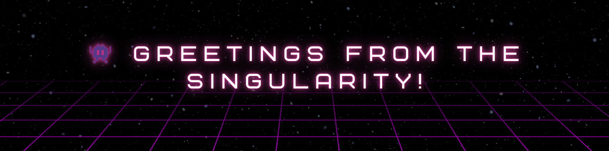

  

###

<h1 align="center">Hi, I’m Hammad</h1>

###

I build stuff out of curiosity.  If you've got a weird idea, broken code, or just wanna pretend we know what we're doing — I'm in. Let's build.... or at least try☕
 

###

<h3 align="center">📡 Ping me on the socials:</h3>

###

  &nbsp;&nbsp;&nbsp;
  

 

###

<h3 align="center">💻 Tech I Roll With:</h3>

###

  
  
  
  
  
  
  
  
  
  
  
  
  
  
  
  
  
  
  
  
  
  
  
  
  
  
  
  
  

  

###

  

###
